# Mermaid Diagram Templates

## Flowchart Templates

### Basic Process Flow
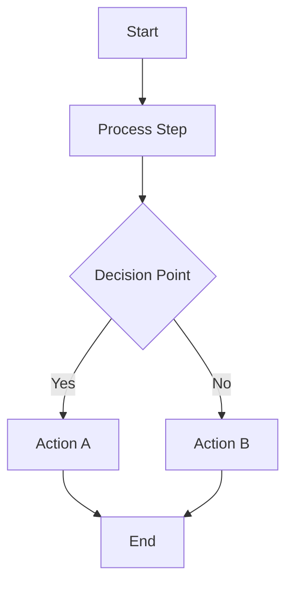

### User Authentication Flow
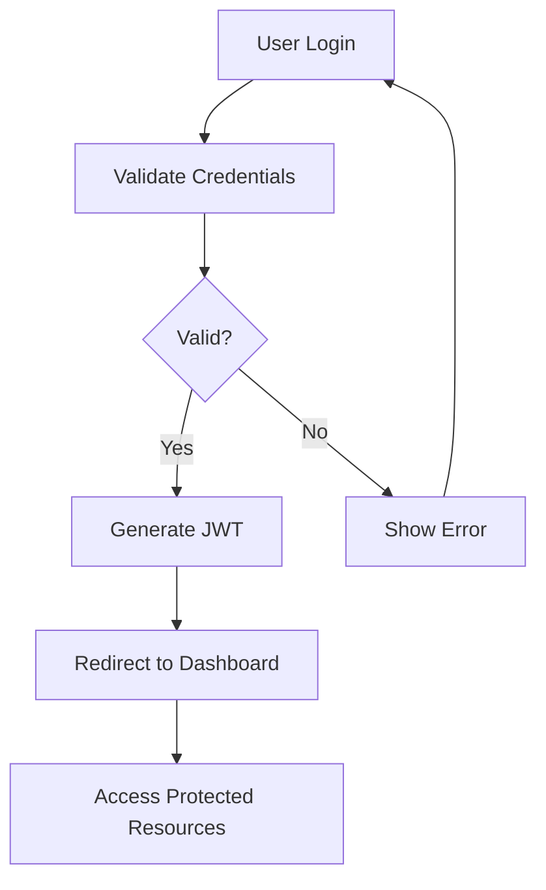

### API Request Flow
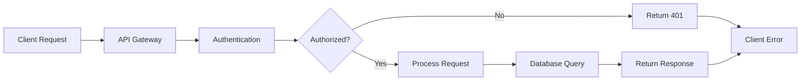

## Sequence Diagrams

### User-API Interaction
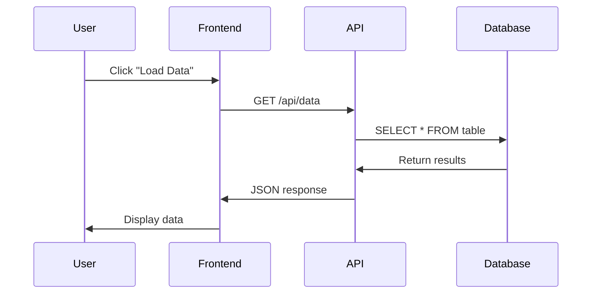

### Authentication Sequence
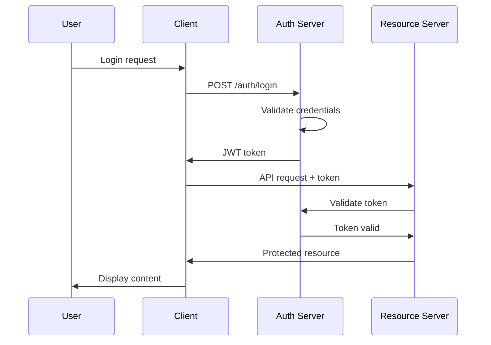

## Class Diagrams

### Vehicle System
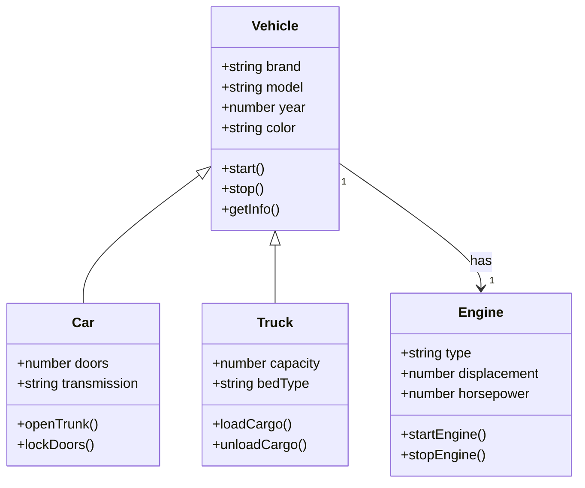

### User Management System
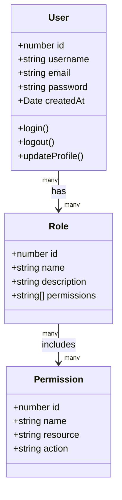

## Entity-Relationship Diagrams

### E-commerce Database
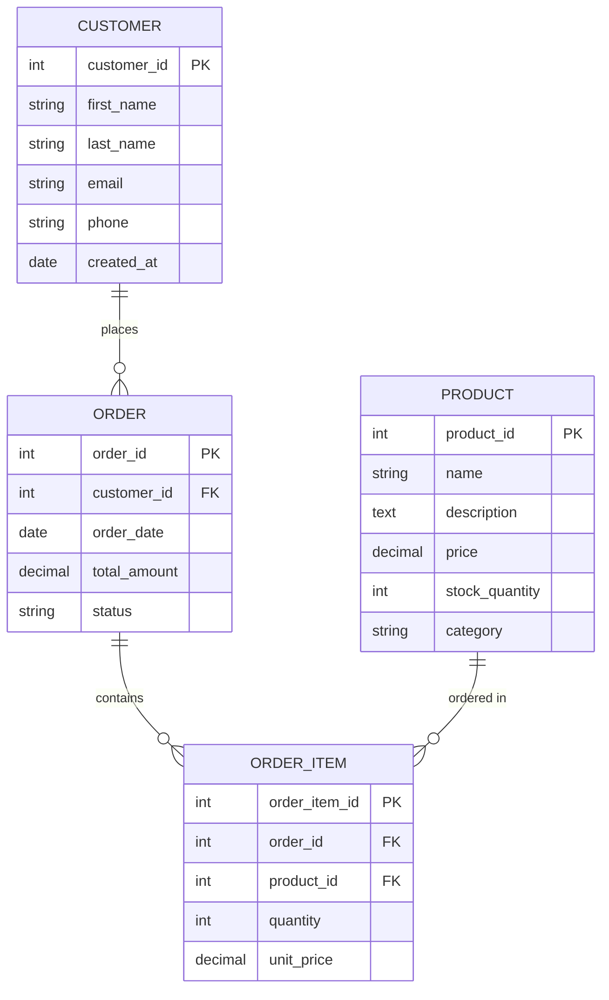

### Blog System
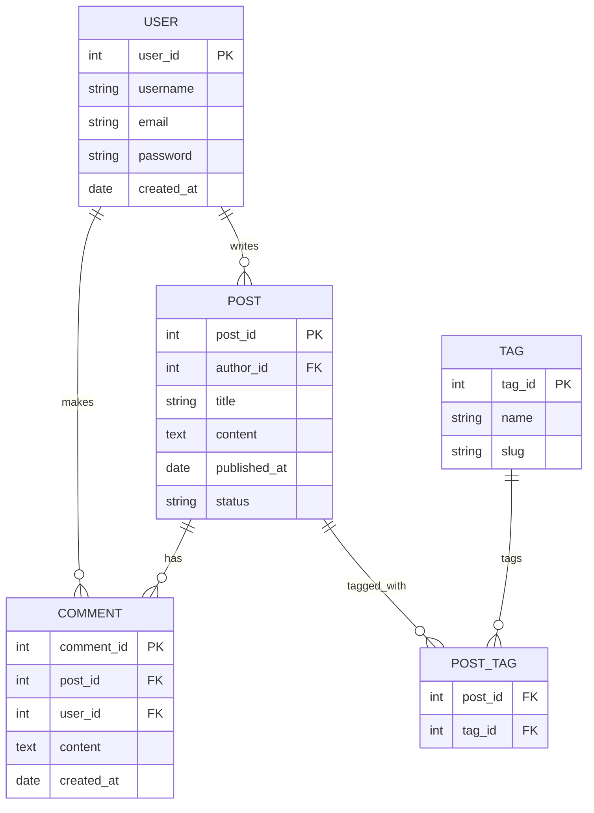

## Architecture Diagrams

### Microservices Architecture
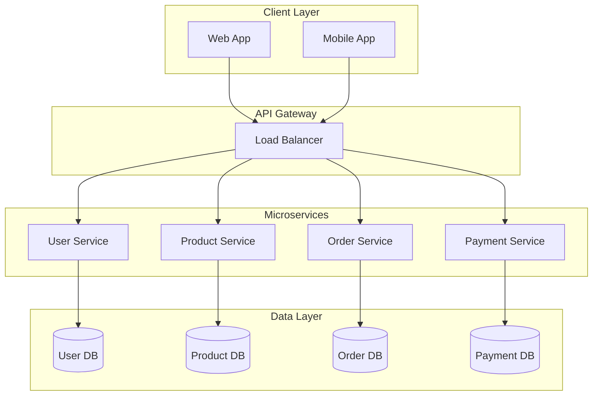

### CI/CD Pipeline
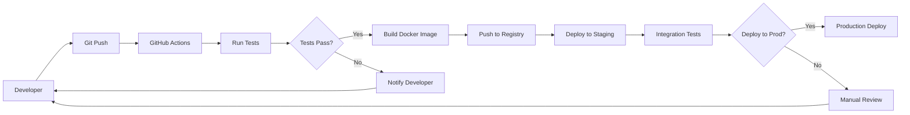

## Special Characters Reference

When using Mermaid in v0 context:
- Use `#43;` for `+` symbol
- Use `#45;` for `-` symbol  
- Use `#61;` for `=` symbol
- Use `#40;` for `(` symbol
- Use `#41;` for `)` symbol
- Always use quotes around node names: `"Node Name"`